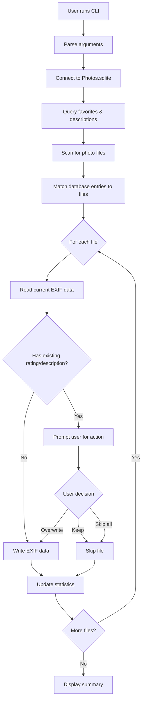

# Architecture

## System Overview

`iPhoneFavoritesToExif` is designed as a single-threaded, batch-processing command-line application. The architecture follows a simple pipeline pattern: read database → find files → process each file → write EXIF.

## Project Structure (Planned)

```
iPhoneFavoritesToExif/
├── migrate_photos.py         # Main entry point and CLI
├── requirements.txt           # Python dependencies
├── README.md                  # User documentation
├── .gitignore                 # Git configuration
└── src/                       # Source modules (optional organization)
    ├── database.py            # Photos.sqlite reader
    ├── file_scanner.py        # Photo file discovery
    ├── exif_handler.py        # EXIF operations wrapper
    └── migrator.py            # Main migration logic
```

**Note**: For a simple project like this, all code could live in a single `migrate_photos.py` file. Modular structure shown above is optional and should be used if the project grows.

## Core Components

### 1. Database Reader
**Purpose**: Extract favorites and descriptions from iPhone's Photos.sqlite

**Key Responsibilities**:
- Connect to SQLite database
- Query for favorites status (binary flag)
- Query for image descriptions (text field)
- Map database records to filenames

**Critical Details**:
- iPhone Photos.sqlite schema varies by iOS version
- Need to handle ZASSET table for photos
- ZFAVORITE column indicates favorites
- Description might be in ZADDITIONALASSETATTRIBUTES or ZEXTENDEDATTRIBUTES
- Filename mapping: ZFILENAME or ZDIRECTORY + ZFILENAME

### 2. File Scanner
**Purpose**: Locate photo files in the copied directory structure

**Key Responsibilities**:
- Recursively search from root directory
- Identify 100APPLE folders (and similar patterns like 101APPLE, etc.)
- Build file path inventory
- Match filenames from database to actual files

**Implementation Notes**:
- Use `os.walk()` for directory traversal
- Pattern: `*/[0-9]+APPLE/*`
- Support common image formats: .jpg, .jpeg, .heic, .png
- Handle case-insensitive matching (Windows consideration)

### 3. EXIF Handler
**Purpose**: Interface with exiftool for reading and writing EXIF metadata

**Key Responsibilities**:
- Check if exiftool is installed
- Read existing rating and description from images
- Write rating and description to EXIF fields
- Handle errors gracefully

**EXIF Field Mapping**:
- Favorites → `Rating` (value: 5 for favorite, 0 for non-favorite)
- Description → `ImageDescription` or `Description`

**Implementation**:
- Use subprocess to call exiftool command
- Alternative: PyExifTool wrapper library
- Batch operations for efficiency (exiftool supports multiple files)

### 4. Migrator (Orchestration)
**Purpose**: Coordinate the migration process

**Key Responsibilities**:
- Parse command-line arguments
- Initialize database connection
- Scan for files
- For each photo:
  - Get metadata from database
  - Check existing EXIF data
  - Handle conflicts (prompt user)
  - Write EXIF data
- Report statistics (processed, skipped, errors)

**Conflict Resolution Logic**:
```
IF file has existing rating OR description:
    DISPLAY current values
    PROMPT user: "Overwrite (y), Keep existing (n), or Skip all conflicts (s)?"
    IF user chooses "y": write new data
    IF user chooses "n": skip this file
    IF user chooses "s": skip all future conflicts
ELSE:
    Write new data directly
END
```

## Data Flow



## Key Design Decisions

### 1. Single Command Execution
- All operations happen in one run
- No daemon or persistent state
- Simple error handling and logging to console

### 2. Safety First
- Always read before writing
- User confirmation for conflicts
- No automatic overwrites without checking
- Non-destructive (only adds/modifies EXIF, doesn't touch source database)

### 3. Flexible Input
- Database path as argument (handles renamed files)
- Root directory as argument (no hardcoded paths)
- Support for various iOS versions (query schema dynamically)

### 4. External Dependency: exiftool
- Rely on mature, well-tested tool for EXIF operations
- Better than implementing EXIF writing from scratch
- Cross-platform compatibility
- Handles various image formats (JPEG, HEIC, PNG, etc.)

## Error Handling Strategy

1. **Missing exiftool**: Detect at startup, provide installation instructions
2. **Invalid database**: Check file exists and is SQLite format
3. **Database schema mismatch**: Handle gracefully, warn user about iOS version
4. **File not found**: Skip with warning (database might reference deleted photos)
5. **EXIF write failure**: Log error, continue with remaining files
6. **User interruption**: Catch Ctrl+C, display partial results

## Performance Considerations

- Processing is I/O bound (database reads, file system scans, EXIF writes)
- For large photo libraries (1000+ photos), consider:
  - Progress bar or counter
  - Batch EXIF operations where possible
  - Skip already-processed files (optional future enhancement)
- Single-threaded is sufficient for typical use cases

## Future Enhancement Opportunities

1. **Dry-run mode**: Show what would change without modifying files
2. **Selective processing**: Only process favorites, or only descriptions
3. **Batch conflict resolution**: "Overwrite all" or "Keep all" options
4. **Resume capability**: Track processed files to avoid re-processing
5. **Logging**: Write detailed log file in addition to console output
6. **Bidirectional sync**: Read EXIF and write back to database (complex!)